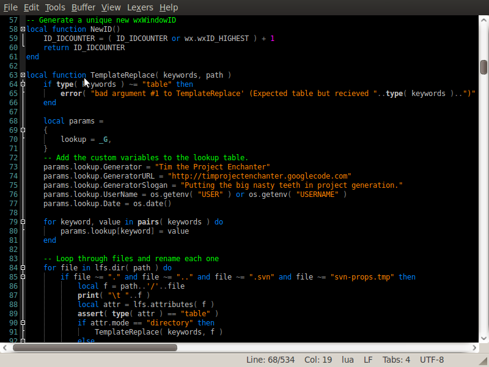
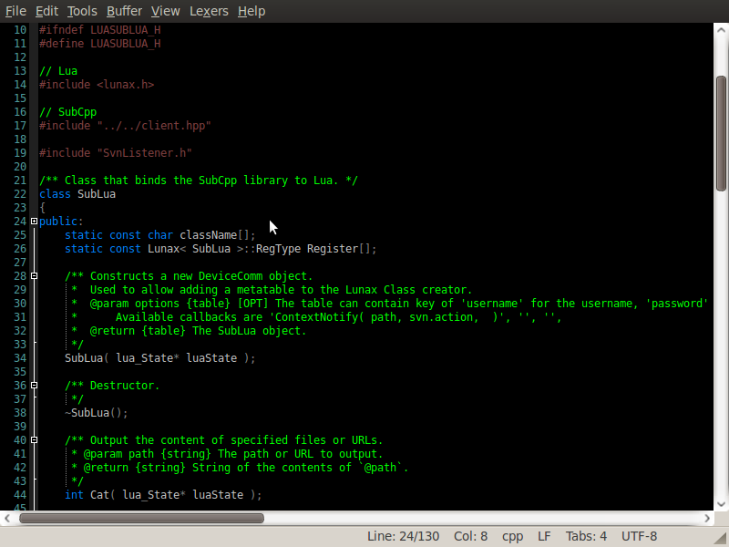
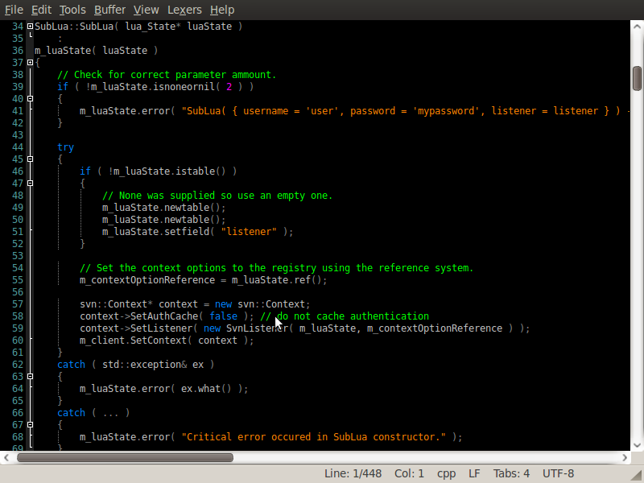

## Download

### TextAdept v7.x-9.x

[Black v1.00](BlackTheme/text-adept7-black-theme-v1-00.zip)

## Install

1. Extract the downloaded `*.zip` file into your *~/.textadept/themes*
   directory.
2. Add `black` to your *~/.textadept/theme* file.
3. Restart TextAdept to see the changes.

## ScreenShot

Lua file

C++ header file

