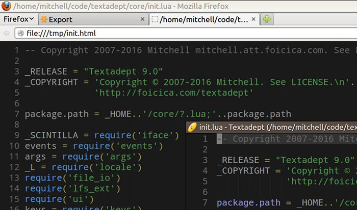

## Introduction

This is a Textadept module for exporting buffers to various formats like HTML
for printing.

## Download

[Download](https://github.com/orbitalquark/textadept-modules/blob/default/export/init.lua)

## Usage

Download the file(s) into a *~/.textadept/modules/export/* directory and add the
following to your *~/.textadept/init.lua*:

    _M.export = require('export')

There will be a "File -> Export" menu.

By default HTML files are opened in Firefox. If you prefer to use another
browser, put the following in your *~/.textadept/init.lua* after the require:

    _M.export.browser = 'chromium-browser'
